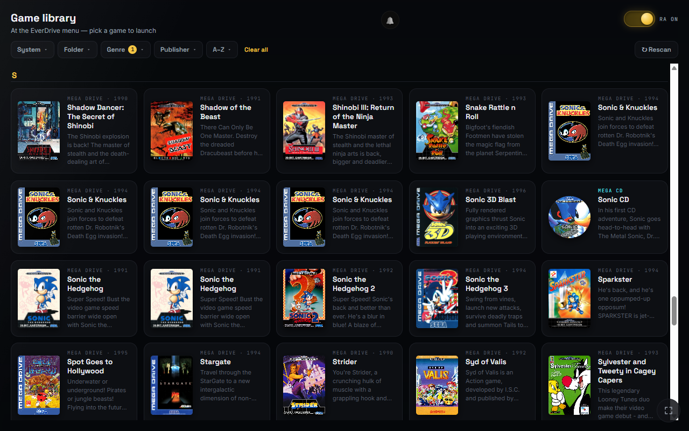
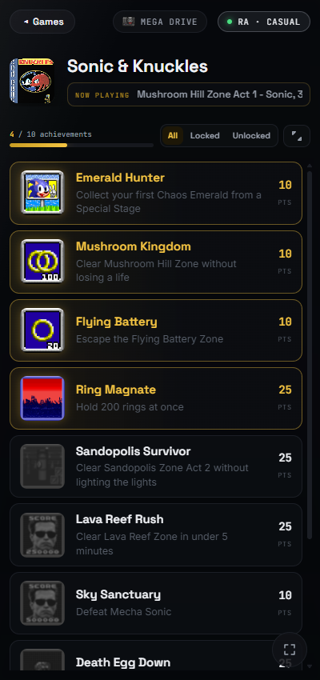
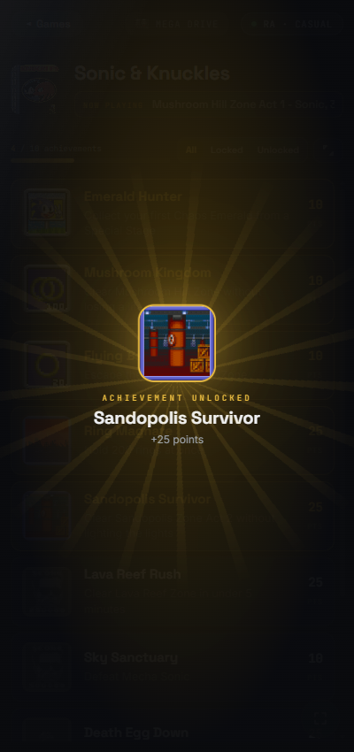
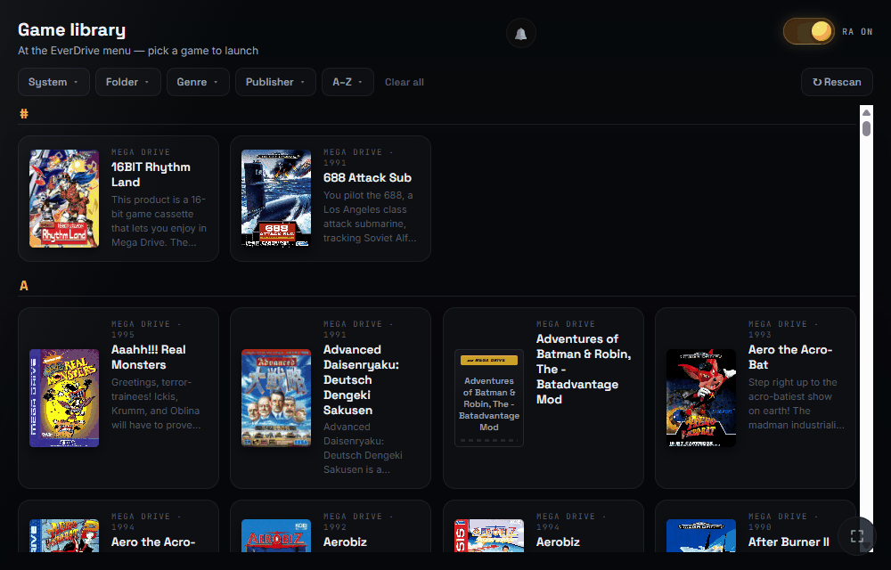

# Achievement Box

**RetroAchievements on a real Mega Drive.** Runs on your PC, talks to a **Mega
EverDrive Pro** over USB, reads console work-RAM live, evaluates
RetroAchievements sets with
[rcheevos](https://github.com/RetroAchievements/rcheevos), submits unlocks, and
serves a web UI (phone, tablet, or PC) — with a full-screen takeover when you
earn one.

> **Status: early and actively developed.** Tested on **Windows/PC**, with the
> **Mega Drive** path. That path is the novel piece — a custom FPGA mapper that
> passively shadows work-RAM into the cart's spare SRAM so the host can read it —
> and it's still in bring-up, so expect rough edges. Other consoles (e.g. an SNES
> path via the existing usb2snes ecosystem) and a headless always-on appliance
> are planned but **not built or validated yet**.
> Achievement sessions currently require **NTSC/60Hz console mode**; PAL/50Hz
> sessions fail closed as unavailable. Mega CD titles may appear in the library
> and can be launched, but do not support achievements.



## How it works

The Mega EverDrive Pro has no command to read live work-RAM — so Achievement Box
adds a way to read it, **passively**.

The cart's mapper layer is open
([krikzz/mega-ed-pub](https://github.com/krikzz/mega-ed-pub)) and exposes the
full console bus to the FPGA. Our mapper ([`fpga/`](fpga/)) adds a **work-RAM
sniffer** that watches every console-bus write and shadows each work-RAM write
into the cart's otherwise-unused 512 KB SRAM chip. The host then reads that
shadow with krikzz's **existing** USB memory commands. **No ROM patching
anywhere** — purely passive observation.

Games are identified by hashing the pristine ROM (exactly as RetroAchievements
does), and unlocks are submitted in **Casual mode** (formerly softcore).
Hardcore is unconditionally disabled in the native client. The browser cannot
award achievements: it only displays state and requests launches or mapper
changes; unlocks originate from `rcheevos` evaluating observed console memory.
Unlocks earned while offline are not lost: submissions are queued locally
(encrypted at rest) and replayed automatically — surviving daemon restarts —
once connectivity to RetroAchievements returns.
See [COMPLIANCE.md](COMPLIANCE.md) for the full good-faith design principles,
[PRIVACY.md](PRIVACY.md) for stored and transmitted data and [NOTICE](NOTICE)
for the exact upstream attribution and FPGA source split.

> **Other consoles.** The daemon is built around a small `MemoryBackend`
> interface, so additional memory sources can slot in later — an SNES path on
> top of [usb2snes](https://github.com/Factor-64/RA2Snes)/SD2SNES is the obvious
> next one. Only the Mega Drive backend exists today.

## The web UI

Any browser on the LAN is the display — phone, tablet, or PC, installable as a
PWA.

<p>
  
  
</p>



- The game library is scanned straight off the cart's SD card and shown with
  box art. Browse it properly: **faceted filters** (system, folder, genre,
  publisher) that combine, an **A–Z letter jump** for big collections, and
  filter choices remembered per device. Tap a game and it launches on the
  console.
- A live session view (WebSocket, no refreshing): the full achievement list —
  filterable by locked/unlocked — with points and progress, and the game's
  **Rich Presence** line, the same "what you're doing right now" text RA shows
  on your profile, updating as you play.
- Earning an achievement triggers a **full-screen takeover** with the RA badge
  art, plus an optional push notification; multiple unlocks queue one at a
  time, never overlapping.
- Badge and box art are cached locally after first fetch, so a WiFi blip never
  blanks the screen.
- The browser is a viewer and remote only — it can launch games and flip the
  RA switch, but it cannot award anything; unlocks come exclusively from the
  daemon evaluating console memory.

## Repository layout

    daemon/     Python daemon: memory backends, rc_client bridge, FastAPI +
                websocket web server.
    webui/      The web UI — an installable PWA (dark theme, mobile-first, live
                updates, unlock takeover); works in any browser.
    fpga/       Mega EverDrive Pro mapper — a fork of krikzz/mega-ed-pub with our
                work-RAM sniffer added. Ships a prebuilt core (fpga/prebuilt/).

## Quickstart

Clone with the pinned USB-tool submodule, create a virtual environment and
install the daemon dependencies:

```powershell
git clone --recurse-submodules https://github.com/philmole/achievement-box
cd achievement-box
python -m venv .venv
.venv\Scripts\pip install -r daemon\requirements.txt
copy daemon\.env.example daemon\.env
```

Edit `daemon\.env` and set `RA_USER`, `RA_PASS` and `MD_ROM_DIR`. Credentials
remain local and the file is ignored by Git. Then start the supervised server:

```powershell
.venv\Scripts\python daemon\serve.py
```

Open one of the printed URLs on a browser on the same trusted LAN. Set a unique
`WEB_PASSWORD` of at least 12 characters if other LAN users should not be able
to launch games or change the mapper; authenticated LAN access uses HTTPS.

The Mega Drive path uses krikzz's `edlink.exe` from the
[`references/mega-ed-pub`](references/mega-ed-pub) submodule (already present
after the clone above; if you skipped `--recurse-submodules`, run
`git submodule update --init`). No `MED_EDLINK` setting is needed at the
default submodule path. The prebuilt FPGA core is included in
`fpga/prebuilt/` — turn the library's **RA on** switch on to stage it in the
configured games folder for the next launch — and it can be rebuilt from
source; see [fpga/README.md](fpga/README.md).

While the RA core is loaded there is no in-game menu. To get back to the
EverDrive menu, hold **Down + Start** on the controller for a moment — the combo
is detected over USB, so the reset can take a few seconds to kick in.

## What's next

Where this is headed (none of these are built yet):

- **SNES support.** The daemon is structured around a small `MemoryBackend`
  interface; an SNES backend on top of
  [usb2snes](https://github.com/Factor-64/RA2Snes)/SD2SNES is the natural next
  console — most of the ecosystem work is already done there.
- **Headless appliance.** Running the box unattended on a small always-on host
  (e.g. a Raspberry Pi), with any browser — phone, tablet, or PC — as the
  display.
  The software is written with this in mind, but it hasn't been validated on
  that hardware yet.
- **More Mega Drive coverage.** Broadening mapper support; SMS mode is an
  experimental stretch. (The sniffer has survived a 30-minute DMA-heavy
  stress soak — Vectorman, zero dropped writes.)

## A note on AI assistance

This project was built with AI assistance (Claude).

## Security boundary

Run Achievement Box only on a trusted local network and do not expose its ports
to the internet. Optional browser authentication protects the LAN control
plane, but it is not a Hardcore attestation mechanism: a person or process able
to replace the daemon, DLL, FPGA core or observed memory is inside the trusted
host boundary. This release therefore remains Casual-only and fails closed when
the mapper is inactive, the console is in PAL/50Hz mode, or FPGA capture reports
a dropped WRAM write.

## Licensing

Original work in this repository (the daemon, the web UI, and the original
gateware) is licensed under the **GNU GPL v3.0** — see [LICENSE](LICENSE).

The `fpga/` tree contains Achievement Box's original gateware plus a patch
against krikzz's Mega EverDrive Dev Sources, which are referenced as a pinned
submodule rather than copied into this repository; they are credited and not
relicensed. The shipped `.rbf` is Achievement Box's custom build of that
upstream base plus our original gateware; it is not an upstream krikzz binary.
`rcheevos` is used under the MIT License. Full third-party attribution is in
**[NOTICE](NOTICE)**.

Achievement Box does not operate telemetry or cloud services. See the
**[privacy policy](PRIVACY.md)** for local data, external services, retention
and deletion details.

Achievement Box is free software and has no monetization, paid tier, in-app
purchases or commercial feature restrictions.

## Thanks & acknowledgements

Credit where it's due — this project integrates and builds on some excellent
work:

- **[RetroAchievements](https://retroachievements.org)** — the achievement
  platform, sets, and community this project targets, and
  **[rcheevos](https://github.com/RetroAchievements/rcheevos)**, its
  achievement-evaluation engine (used in the daemon under MIT).
- **[krikzz](https://github.com/krikzz/mega-ed-pub)** — for the Mega EverDrive
  Pro and for publishing its mapper sources openly, which the Mega Drive path
  forks and extends.
- **[RA2Snes](https://github.com/Factor-64/RA2Snes)** (Factor-64) — a SNES
  reference that proves the flow on real hardware.
- **[nes-ra-adapter](https://github.com/odelot/nes-ra-adapter)** (odelot) — an
  architecture cousin worth a look (CRC game ID, frame-cadence heuristic,
  compatibility tracking).
